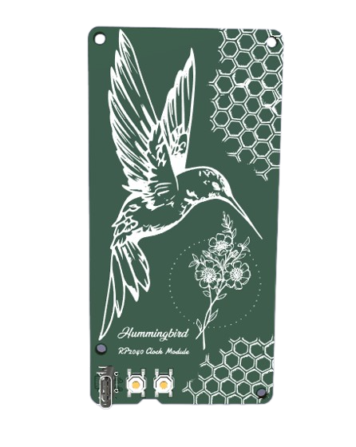

# Hummingbird RP2040 Clock Module
This module will be used craft artisan clocks by combining it with a seperate clock faces. This will allow this design to be shared amongst different display technologies.

 
## Features:
* Raspberry Pi RP2040 uC w/ Dual core ARM Cortex-M0+
* Highly compatible with JLCPCB's basic SMT parts
* Powered USBC with ESD and reverse polarity protection
* DS1307Z+ RTC and CR2032 coin cell battery
* Single sided design except for USBC and two buttons for a compact, flush mount.
* Photocell/LDR support for  for display autodimming
* Additional features include piezoelectric buzzer, RGB LED, PWR switch, and optional OLED
* FFC Expansion to support modular clock face

## Clock Ideas:
A short list of various clocks I would like to build using this base module.
* Life Clock: A countdown to estimated time of death using seven segment displays
* Nixie Clock: My own take on the classic nixie tube clock using my favourite IN-12 tubes
