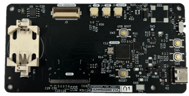

# Hummingbird RP2040 Clock Module
This module will be used craft artisan clocks by combining it with a seperate clock faces. This will allow this design to be shared amongst different display technologies.

## Status:
PCBA arrived and user LED is blinking. Need to solder 3-4 parts myself.

 
## Features:
* Raspberry Pi RP2040 uC w/ Dual core ARM Cortex-M0+
* Highly compatible with JLCPCB's basic SMT parts
* Powered USBC with ESD and reverse polarity protection
* DS1307Z+ RTC and CR2032 coin cell battery
* Single sided design for a compact flush mount.
* Photocell/LDR support for  for display autodimming
* Additional features include piezoelectric buzzer, RGB LED, PWR switch, and optional OLED
* FFC Expansion to support modular clock face

## Clock Ideas:
A short list of various clocks I would like to build using this base module.
* Life Clock: A countdown to estimated time of death using seven segment displays
* Nixie Clock: My own take on the classic nixie tube clock using my favourite IN-12 tubes

## Notes
* From 2024 when I did the schematic to 2025 when I did the layout I noticed jlc pcba changed a lot of their basic parts, and increased their extended reel fee from 1 to 3 dollars which increased cost a lot for small run asm. 
* Cost of each assembled PCB is roughly $8-10 USD excluding setup fees. Total order for 2PCBA 3PCB was ~$57 + ~$17 shipping - Discounts = $70 USD Spent + 10-20 at LCSC or Digikey for extras. Largest cost was reel fees at $30, See -> ./images/cost2.png

## Image Appendix

