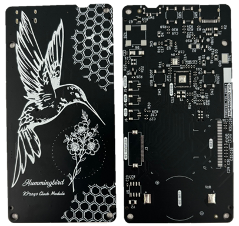

# 🐦 Hummingbird RP2040 Clock Module ⏰

 
 

The **Hummingbird RP2040 Clock Module** is designed for crafting artisan clocks by pairing it with different clock faces. Its modular design allows this project to be shared across various display technologies.

The test OLED above shows time, my age, and my time to death countdown based on my life expectancy.

---

## 🔧 Features
- Raspberry Pi RP2040 microcontroller with dual-core ARM Cortex-M0+
- Highly compatible with JLCPCB's basic SMT components and 2L stackup for cost
- Powered via USB-C with ESD and reverse polarity protection
- DS1307Z+ RTC with CR2032 coin cell backup
- Single-sided design for a compact, flush mount
- Photocell/LDR support for automatic display dimming
- Additional features: piezoelectric buzzer, RGB LED, power switch, and optional OLED
- FFC expansion for modular clock face integration

---

## 📦 Status
> The PCBA has arrived, and is working, it needed one bodge. FW is done.

---

## 💡 Clock Ideas
Clocks I plan to build using this module:

Click to expand

- **Life Clock:** A countdown to estimated time of death using seven-segment displays
- **Nixie Clock:** A personal take on the classic Nixie tube clock, featuring IN-12 tubes
- **0402 Year Calendar** Inspired by the Yetch THE EVERY DAY GOAL CALENDAR

---

## 📝 Notes

Click to expand

- I had a few issues with the v1 hardware design since I completed it in roughly two days. Might do a v2.
- From 2024 (schematic design) to 2025 (layout), JLC PCB assembly changed many basic components and increased extended reel fees from $1 → $3, significantly affecting small-run costs.
- The cost per assembled PCB is approximately $8–10 USD, excluding setup fees. A total order of 2 PCBAs + 3 PCBs came to ~$57 + ~$17 shipping. After discounts, the total spent was ~$70 USD, plus $10–20 for extra parts from LCSC or Digikey. The largest expense was reel fees ($30).

See: -> ./images/cost2.png

---

## 🖼️ Image Appendix

